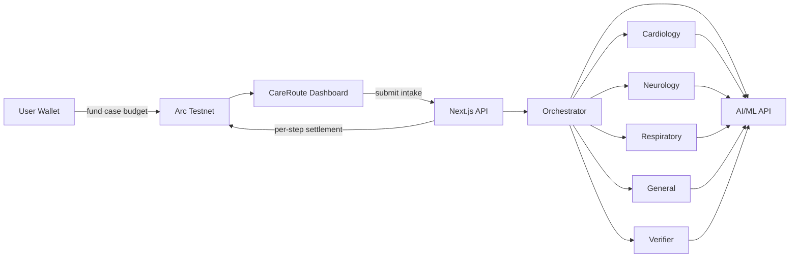
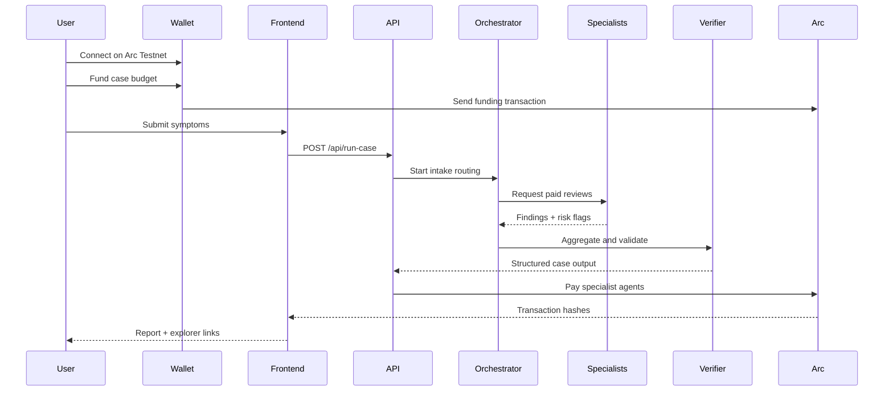

# CareRoute

CareRoute is a wallet-funded clinical workflow assistant built for the **Agentic Economy on Arc** hackathon. A user funds a small case budget in USDC on **Arc Testnet**, specialist agents are invoked only when needed, and every paid step settles onchain with visible receipts.

This is a **clinical intake routing** product, not diagnosis software and not medical advice.

## What CareRoute does

- connects a real user wallet on Arc Testnet
- funds a small per-case budget from the user's wallet
- routes symptom intake through an orchestrator and specialist agents
- pays per analysis step instead of charging a flat subscription
- returns a structured workflow report with risk flags, urgency, and specialist reasoning
- shows real Arc explorer links for funding and agent settlement transactions

## Hackathon fit

- Primary track: `Usage-Based Compute Billing`
- Secondary track: `Agent-to-Agent Payment Loop`
- Additional fit: `Per-API Monetization Engine`

Why it fits:
- the user pays only for the compute actually used on a case
- the orchestrator pays specialist agents step by step
- each specialist can be treated as a paid agent endpoint

## The problem

Clinical intake workflows are usually priced as flat software seats or bundled service contracts, even when each case only uses a small amount of actual reasoning. That model is inefficient for short-lived AI workflows where each routing decision may only justify fractions of a cent in value. On traditional high-gas chains, these tiny per-step settlements are economically irrational. On Arc, they become viable.

## The solution

CareRoute turns clinical intake into a **user-funded, usage-based agent workflow**:

1. the user connects a wallet
2. the user funds a tiny case budget
3. the orchestrator summarizes intake and decides which specialists are needed
4. specialist agents produce structured reviews
5. a verifier agent aggregates findings and urgency
6. each step is settled on Arc and shown in the dashboard

## Core workflow



## Runtime sequence



## Agent roles

| Agent | Job | Typical spend |
|---|---|---:|
| Orchestrator | intake summary, routing, case coordination | `$0.001` |
| Cardiology | cardio symptom review | `$0.002` |
| Neurology | neuro symptom review | `$0.002` |
| Respiratory | respiratory symptom review | `$0.002` |
| General | fallback general review | `$0.002` |
| Verifier | second opinion and final output | `$0.001` |

## Why Arc matters

CareRoute is built around **sub-cent economic viability**.

- typical case cost in CareRoute: around `$0.004 - $0.008`
- multiple specialist steps can settle independently
- judges can see repeated onchain receipts in a single live session

On traditional high-gas chains, a few dollars of gas to settle fractions of a cent destroys the unit economics. Arc's stablecoin-native, fast settlement model is what makes the workflow credible.

## Stack

- **Frontend:** Next.js 15, React 18
- **Wallet UX:** wagmi, RainbowKit
- **Chain client:** viem
- **Chain target:** Arc Testnet
- **AI routing:** AI/ML API
- **Notifications:** sonner

## Repository structure

```text
app/
  page.tsx
  dashboard/page.tsx
  api/run-case/route.ts
  api/run-batch/route.ts
  api/refund-budget/route.ts
components/
  landing-page.tsx
  dashboard-page.tsx
  connect-button.tsx
  wallet-provider.tsx
lib/
  aiml.ts
  arc.ts
  care-route.ts
  transactions.ts
  types.ts
README.md
SUBMISSION.md
output/
  CareRoute_Hackathon_Deck.pptx
```

## Environment variables

Copy `.env.example` to `.env.local` and fill the required values.

### Wallet and chain

- `NEXT_PUBLIC_ARC_RPC_URL`
- `NEXT_PUBLIC_ARC_CHAIN_ID`
- `NEXT_PUBLIC_ORCHESTRATOR_ADDRESS`
- `ORCHESTRATOR_ADDRESS`
- `ORCHESTRATOR_PRIVATE_KEY`

### Agent recipients

- `CARDIOLOGY_AGENT_ADDRESS`
- `NEUROLOGY_AGENT_ADDRESS`
- `RESPIRATORY_AGENT_ADDRESS`
- `GENERAL_AGENT_ADDRESS`
- `VERIFIER_AGENT_ADDRESS`

### AI routing

- `AIML_API_KEY`
- `AIML_BASE_URL`
- `AIML_MODEL`

## Local setup

```bash
npm install
npm run dev
```

Open:

- `http://localhost:3000`

## Real test flow

1. connect wallet on Arc Testnet
2. fund the case budget
3. paste a symptom intake
4. click `Run Case`
5. inspect the structured report
6. open the Arc explorer links from the dashboard

Suggested test input:

```text
54-year-old with chest pain radiating to the left arm, shortness of breath, mild dizziness, and fatigue for 2 days. No known trauma. Symptoms worsen on exertion.
```

## Submission talking points

- **Business value:** usage-based clinical workflow automation
- **Originality:** user-funded case budgets with specialist agent routing
- **Technical proof:** real Arc-settled per-step payouts
- **Hackathon proof:** visible sub-cent pricing and repeated transactions

## Safety note

CareRoute is a **clinical workflow assistant** for intake routing and structured risk flagging. It does not diagnose, prescribe, or replace clinician judgment.
