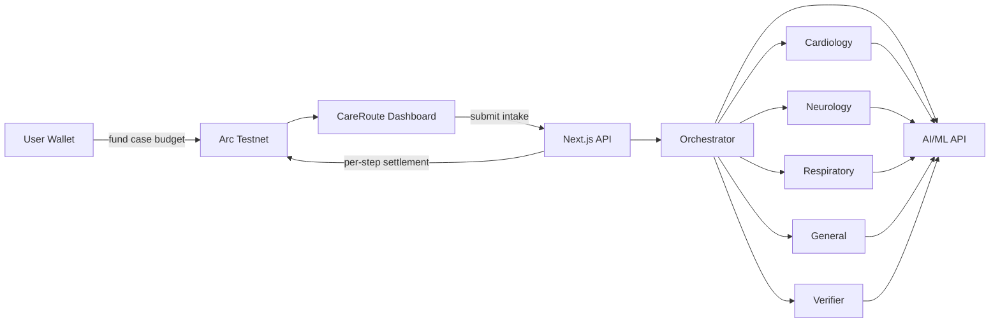
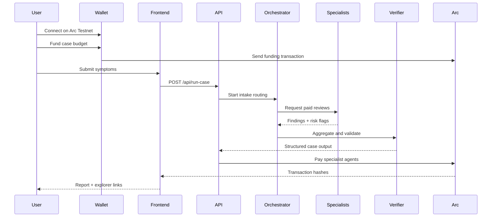

# CareRoute

**Clinical intake, priced per step.**

CareRoute is a wallet-funded clinical workflow assistant built for the **Agentic Economy on Arc** hackathon. A user funds a small USDC case budget on Arc Testnet, specialist AI agents consume it step by step, and every payment settles onchain with real Arcscan receipts.

> ⚠️ CareRoute is a **clinical workflow routing assistant**, not diagnosis software and not medical advice.

---

## How it works

1. **Connect wallet** on Arc Testnet (MetaMask or compatible)
2. **Fund a case budget** - send a small USDC amount to the orchestrator wallet
3. **Submit symptom intake** - describe symptoms in plain text
4. **Agents route the case** - orchestrator decides which specialists are needed
5. **Each specialist settles onchain** - Cardiology, Neurology, Respiratory, or General agents each pay $0.002 per review
6. **Verifier closes the case** - aggregates findings, risk flags, and urgency at $0.001
7. **Unused budget can be refunded** - full user custody throughout

---

## Agent workflow

```text
Patient Input -> Orchestrator ($0.001) -> Specialist Agents ($0.002 each) -> Verifier ($0.001)
```

| Agent | Role | Cost |
|---|---|---:|
| Orchestrator | Intake summary + specialist routing | $0.001 |
| Cardiology | Cardiovascular symptom review | $0.002 |
| Neurology | Neurological symptom review | $0.002 |
| Respiratory | Respiratory symptom review | $0.002 |
| General | Fallback broad review | $0.002 |
| Verifier | Second opinion + final structured output | $0.001 |

**Typical total case cost: $0.006-$0.008**

---

## Hackathon fit

- **Usage-Based Compute Billing** - each agent charges for the compute it actually runs
- **Agent-to-Agent Payment Loop** - orchestrator pays specialist agents from the user-funded budget
- **Per-API Monetization Engine** - each specialist is a paid agent endpoint with onchain proof

---

## Architecture

## Core workflow



---

## Runtime sequence



---

## Why Arc?

| | CareRoute on Arc | Illustrative L1 (gas) |
|---|---|---|
| Case cost | ~$0.008 | ~$18.40 |
| Settlement | Sub-second finality | Variable, slow |
| Economics | Viable | Margin-destroying |

On traditional high-gas chains, paying $4-5 in gas to settle a $0.002 specialist payment makes no economic sense. Arc's stablecoin-native, gas-efficient model is what makes per-step agent billing commercially viable.

---

## Tech stack

| Layer | Technology |
|---|---|
| Frontend | Next.js 15, React 18 |
| Wallet | wagmi, custom WalletProvider |
| Chain client | viem |
| Chain | Arc Testnet (chain ID: 5042002) |
| Settlement | USDC native on Arc |
| AI routing | AI/ML API (GPT-4o) |
| Notifications | sonner |
| Explorer | Arcscan |

---

## Project structure

```text
app/
  page.tsx                    # Landing page
  dashboard/page.tsx          # Main dashboard
  api/run-case/route.ts       # Run a single case
  api/run-batch/route.ts      # Run a batch of demo cases
  api/refund-budget/route.ts  # Refund unused budget

components/
  landing-page.tsx            # Public landing page
  dashboard-page.tsx          # Connected dashboard UI
  connect-button.tsx          # Wallet connect button
  wallet-provider.tsx         # Arc Testnet wallet context
  app-providers.tsx           # App-level providers

lib/
  aiml.ts                     # AI/ML API integration
  arc.ts                      # Arc chain config
  care-route.ts               # Agent orchestration logic
  transactions.ts             # Onchain transfer helpers
  types.ts                    # Shared TypeScript types
  format.ts                   # Formatting utilities
```

---

## Environment setup

Copy `.env.example` to `.env.local` and fill in:

```bash
# Arc Testnet RPC
NEXT_PUBLIC_ARC_RPC_URL=https://rpc.testnet.arc.network
NEXT_PUBLIC_ARC_CHAIN_ID=5042002
NEXT_PUBLIC_ORCHESTRATOR_ADDRESS=0x...   # orchestrator wallet address

# Orchestrator server wallet (for paying agents from backend)
ORCHESTRATOR_PRIVATE_KEY=0x...
ORCHESTRATOR_ADDRESS=0x...

# Specialist agent recipient wallets
CARDIOLOGY_AGENT_ADDRESS=0x...
NEUROLOGY_AGENT_ADDRESS=0x...
RESPIRATORY_AGENT_ADDRESS=0x...
GENERAL_AGENT_ADDRESS=0x...
VERIFIER_AGENT_ADDRESS=0x...

# AI routing
AIML_API_KEY=your_key_here
AIML_BASE_URL=https://api.aimlapi.com/v1
AIML_MODEL=gpt-4o
```

---

## Local development

```bash
npm install
npm run dev
```

Open `http://localhost:3000`

---

## Demo walkthrough

1. Open the app and connect MetaMask on Arc Testnet
2. Click **Fund $0.020** - this sends USDC from your wallet to the orchestrator
3. Paste a symptom description, for example:

   > *54-year-old with chest pain radiating to the left arm, shortness of breath, mild dizziness, and fatigue for 2 days. Symptoms worsen on exertion.*

4. Click **Run Case**
5. Watch the agent flow indicator move through orchestrator -> specialists -> verifier
6. Inspect the structured report: intake summary, risk flags, and urgency level
7. Click any transaction hash to verify it on Arcscan
8. Click **Refund Remaining** to return unused budget to your wallet

---

## Arc integration details

- **Chain:** Arc Testnet, chain ID `5042002`
- **RPC:** `https://rpc.testnet.arc.network`
- **Explorer:** `https://testnet.arcscan.app`
- **Native token:** USDC (18 decimals on Arc)
- **Funding:** user wallet -> orchestrator via `eth_sendTransaction`
- **Agent payouts:** orchestrator private key -> specialist wallets via viem `sendTransaction`
- **All transactions:** confirmed via `waitForTransactionReceipt` before returning to the frontend

---

## Safety note

CareRoute routes and structures clinical intake for workflow purposes only. It does not diagnose, prescribe treatment, or replace clinician judgment. All AI outputs should be reviewed by qualified healthcare professionals.
