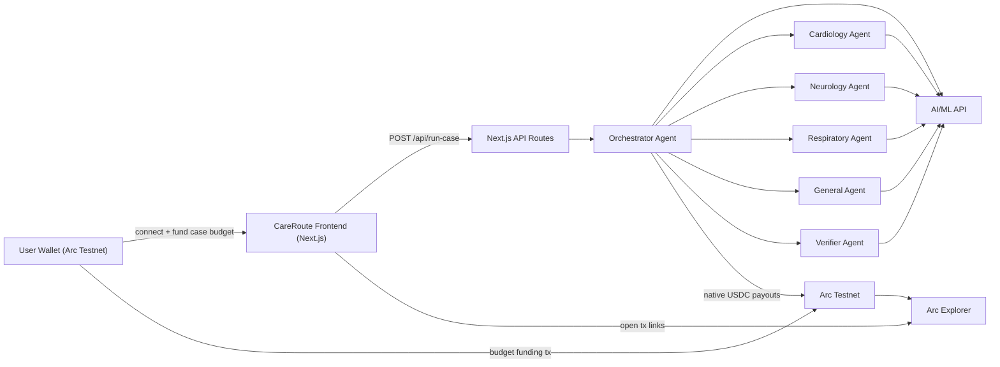
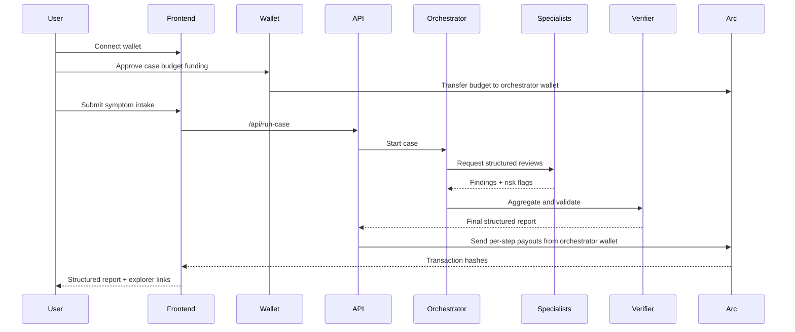

# CareRoute

CareRoute is a Next.js hackathon app for the Agentic Economy on Arc. It presents a clinical workflow assistant, not diagnosis, where an orchestrator routes intake to specialist agents and logs per-step USDC settlement on Arc Testnet.

## Hackathon fit

- Primary track: `Usage-Based Compute Billing`
- Secondary track: `Agent-to-Agent Payment Loop`
- Additional fit: `Per-API Monetization Engine`

The user funds a small case budget from their own wallet. The orchestrator spends from that budget only when specialist agents are actually invoked. This is the core economic proof for Arc.

## Stack

- Next.js 15
- Wagmi + injected wallet connection
- Arc Testnet via viem
- AI/ML API for agent reasoning

## Architecture



## Runtime flow



## Setup

1. Copy `.env.example` to `.env.local`
2. Fill in:
   - `AIML_API_KEY`
   - `AIML_MODEL`
   - Arc testnet agent wallet addresses
   - `ORCHESTRATOR_PRIVATE_KEY` if you want real on-chain USDC transfers
3. Install and run:

```bash
npm install
npm run dev
```

## Arc constants

- RPC: `https://rpc.testnet.arc.network`
- Chain ID: `5042002`
- Explorer: `https://testnet.arcscan.app`
- USDC contract: `0x3600000000000000000000000000000000000000`

## Notes

- Real execution requires:
  - `AIML_API_KEY`
  - `NEXT_PUBLIC_ORCHESTRATOR_ADDRESS`
  - `ORCHESTRATOR_PRIVATE_KEY`
  - all specialist recipient wallet addresses
- The orchestrator private key must be a `0x`-prefixed 32-byte private key.
- For real testnet settlement, fund the orchestrator wallet with Arc testnet USDC and set all specialist recipient addresses.
- This app is a clinical workflow assistant and explicitly not medical advice or diagnosis.
